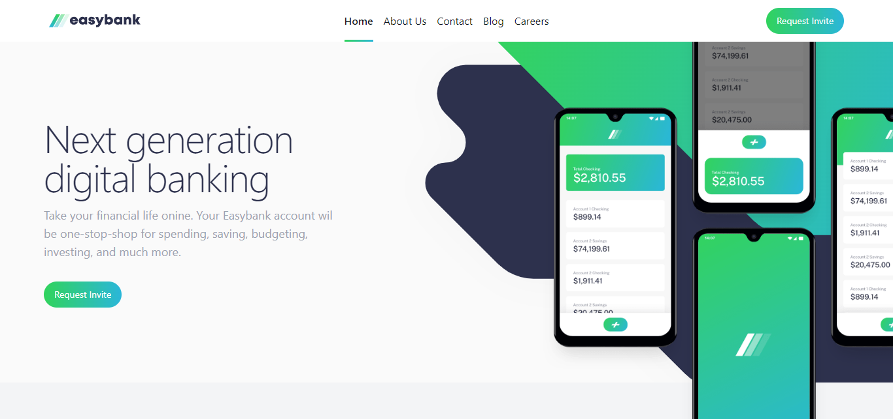
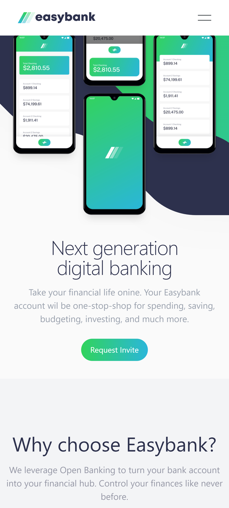

# Frontend Mentor - Easybank landing page solution

This is a solution to the [Easybank landing page challenge on Frontend Mentor](https://www.frontendmentor.io/challenges/easybank-landing-page-WaUhkoDN). Frontend Mentor challenges help you improve your coding skills by building realistic projects. 

## Table of contents

- [Overview](#overview)
  - [The challenge](#the-challenge)
  - [Screenshot](#screenshot)
  - [Links](#links)
- [My process](#my-process)
  - [Built with](#built-with)
  - [What I learned](#what-i-learned)
- [Author](#author)

## Overview

### The challenge

Users should be able to:

- View the optimal layout for the site depending on their device's screen size
- See hover states for all interactive elements on the page

### Screenshot

### Screenshot 1

### Screenshot 2

### Links

- Solution URL: [Github](https://github.com/RafaelSS427/easybank-landing-page)
- Live Site URL: [Go to live site](https://rafaelss427.github.io/easybank-landing-page/)

## My process

### Built with

- Mobile-first workflow
- [React](https://reactjs.org/) - JS library
- [Next.js](https://nextjs.org/) - React framework
- [TailwindCSS](https://tailwindcss.com/) - For styles

### What I learned

I improved my design and responsive skills by using the properties such as z-index, grids, and flex.

## Author

- Website - [Rafael Sequeira Sandoval](https://www.rafael-sequeira-sandoval.dev)
- Frontend Mentor - [@RafaelSS427](https://www.frontendmentor.io/profile/RafaelSS427)
- Github - [RafaelSS427](https://github.com/RafaelSS427)